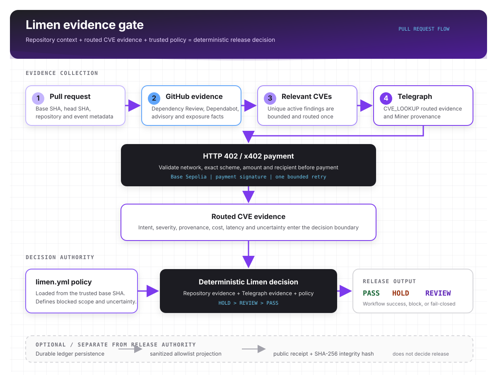

> 🎥 **DEMO VIDEO — TELEGRAPH HACKATHON TRACK 3**
>
> **[Watch the Limen demo on X →](https://x.com/_kaaelaa_/status/2096332395284758815?s=46)**
>
> See the complete release-evidence flow: GitHub repository context → paid Telegraph `CVE_LOOKUP` evidence → `limen.yml` policy → deterministic PASS / HOLD / REVIEW → public proof.

# Limen

Limen is a GitHub-native release evidence and verified remediation layer. It combines repository-specific dependency and exposure evidence from GitHub and Dependabot, independent routed CVE evidence from Telegraph, and deterministic repository policy from `limen.yml` to return `PASS`, `HOLD`, or `REVIEW` before a release proceeds.

`PASS`, `HOLD`, and `REVIEW` remain deterministic. Telegraph supplies evidence; it does not certify safety or exploitability. Missing, conflicting, or unavailable evidence must never silently become `PASS`.

> **PASS, HOLD, or REVIEW is the decision. Verified remediation is the loop that closes it.**

Product loop: `Install -> Evidence -> Decision -> Remediation -> Re-evaluation -> Verified`

## Start Here

| Link | Purpose |
|---|---|
| [Live product](https://limen-mu.vercel.app) | Public Limen web app |
| [Live demo](https://limen-mu.vercel.app/demo) | Product walkthrough |
| [Setup](https://limen-mu.vercel.app/setup) | Integration contract |
| [Live API receipt](https://limen-api-one.vercel.app/v1/receipts/LM-REC-B1306724D0B84B6EBDDF7E36) | Public receipt JSON |
| [Fresh Judge Mode HOLD](https://github.com/kaelah971/limen-demo/actions/runs/33958836557) | Vulnerable dependency path |
| [Fresh Judge Mode PASS](https://github.com/kaelah971/limen-demo/actions/runs/33959096100) | Controlled patched path |
| [Demo PR #1](https://github.com/kaelah971/limen-demo/pull/1) | The repository context behind both runs |
| [Historical public receipt](https://limen-mu.vercel.app/receipt/LM-REC-B1306724D0B84B6EBDDF7E36) | Historical sanitized HOLD projection |

Current hardened Action reference:
`kaelah971/limen@a91d36bfe8eaab5d95f791e39449878239bf948d`

## Why Limen

CI can tell you whether tests passed. A vulnerability source can tell you vulnerability facts. Neither alone answers whether **this repository's release** should proceed under **this repository's policy**.

Limen sits at that threshold. It joins repository-specific exposure evidence, separately routed CVE evidence, and a policy loaded from the trusted base commit. The result is an explicit release boundary rather than a generic security score.

## How It Works

| Boundary | Role |
|---|---|
| GitHub Dependency Review, Dependabot, and advisory APIs | Establish repository-specific package, version, scope, manifest, and exposure facts |
| Telegraph `CVE_LOOKUP` | Supplies separately routed second-source CVE evidence and provenance |
| `limen.yml` | Defines the repository's blocking severities, scopes, and uncertainty behavior |
| Limen decision engine | Applies deterministic precedence and returns `PASS`, `HOLD`, or `REVIEW` |

Repository evidence establishes context. Telegraph supplies routed CVE evidence. Limen policy decides.

A Telegraph response alone does not prove repository exploitability. An HTTP `200` from an external provider is not release approval.



[Open the standalone architecture diagram](public/limen-architecture.svg).

## PASS, HOLD, REVIEW

- `PASS`: available evidence supports proceeding under policy. The workflow succeeds.
- `HOLD`: repository-specific evidence matches a blocking policy condition. The workflow intentionally fails.
- `REVIEW`: evidence is incomplete, conflicting, malformed, unavailable, or otherwise unresolved. The workflow fails closed.

`REVIEW` is not a weak `PASS`. Setup and system failures are not release decisions; they become explicit uncertainty rather than silently approving a release.

## Fresh Hardened Judge Mode

These are existing Judge Mode runs. No new run is required to evaluate this package. Both use the current hardened Action reference shown above.

| Path | Controlled input | Result | Telegraph evidence | Link |
|---|---|---|---|---|
| Vulnerable path | `lodash@4.17.20` | `HOLD` | Five real paid `CVE_LOOKUP` requests; known cost `$0.05`; Base Sepolia; `exact` payment scheme; `usageClass=demo` | [Run 33958836557](https://github.com/kaelah971/limen-demo/actions/runs/33958836557) |
| Patched path | `lodash@4.18.1` | `PASS` with `NO_RELEVANT_VULNERABILITY` | Zero Telegraph requests; known cost `$0.00` | [Run 33959096100](https://github.com/kaelah971/limen-demo/actions/runs/33959096100) |

The HOLD workflow is expected to conclude unsuccessfully because `HOLD` is a release-blocking decision. The PASS workflow concludes successfully. The patched run demonstrates this controlled fixture's result; it does not claim that `lodash@4.18.1` is universally safe.

## Telegraph Integration

Telegraph is a material evidence boundary, not decoration around a local vulnerability database.

- Limen sends the intent `CVE_LOOKUP` through the Telegraph Engine.
- The validated flow handles an HTTP `402` challenge, the official x402 EVM payment flow, and a `PAYMENT-SIGNATURE` retry.
- Current Judge Mode validation uses Base Sepolia (`eip155:84532`) and the `exact` payment scheme.
- Miner provenance, cost, latency, network, scheme, and request timing are retained when safely available.
- A Telegraph transport, challenge, payment, routing, or response failure becomes `REVIEW`; it cannot silently become `PASS`.

### Fresh P14 proof

The fresh vulnerable Judge Mode path made five real paid lookups at a known total cost of `$0.05`. The patched path made zero lookups at a known cost of `$0.00`. These runs are controlled demo evidence and are not receipt publications.

### Historical R0 proof

The historical paid validation records an actual HTTP `402`, official x402 EVM payment construction, an accepted Base Sepolia payment, an HTTP `200` retry, and a supplied settlement transaction reference. See [`Docs/validation-reference.md`](Docs/validation-reference.md) for the reference details. R0 history is separate from fresh P14 Judge Mode proof.

## Evidence and Receipts

The optional hosted ledger and public receipt path are separate from release authority:

- P5 live-validated server-owned persistence for sanitized `usageClass=demo` and `source=backfill` records.
- P6 projects an allowlisted public snapshot and verifies its canonical SHA-256 hash.
- Private ledger reads remain authenticated; public receipt reads expose only the sanitized projection.
- The historical HOLD receipt is [`LM-REC-B1306724D0B84B6EBDDF7E36`](https://limen-mu.vercel.app/receipt/LM-REC-B1306724D0B84B6EBDDF7E36).
- The PASS receipt was intentionally revoked during lifecycle validation and is not an active receipt.
- A receipt hash is an integrity check, not a publisher signature, non-repudiation mechanism, or proof of universal safety.
- P14 fresh Judge Mode did not automatically create receipts.

See [`Docs/evidence-receipts.md`](Docs/evidence-receipts.md), [`evidence/p5/README.md`](evidence/p5/README.md), and [`evidence/p6/README.md`](evidence/p6/README.md).

## Security and Reliability

- Trusted base-SHA policy prevents a pull request from weakening the policy used to evaluate itself.
- The Action uses read-only GitHub APIs and does not checkout, install, build, or execute pull request code.
- Missing, conflicting, malformed, or unavailable evidence fails closed to `REVIEW`.
- Paid lookup budgets and x402 amount, network, scheme, timeout, and origin checks are bounded.
- There is no paid auto-retry after a rejected payment or failed lookup.
- Private keys, payment proof, tokens, and raw provider payloads are redacted from public evidence and telemetry.
- The ledger service role and private ledger routes are server-only; public receipts are an explicit allowlist projection.
- Structured observability and deterministic policy precedence make uncertainty visible.

Deeper details are in [`Docs/security-model.md`](Docs/security-model.md) and [`Docs/architecture.md`](Docs/architecture.md).

## Current Status

Limen currently supports:

- A read-only GitHub Action that evaluates repository evidence without checking out or executing pull request code.
- Deterministic `PASS`, `HOLD`, and `REVIEW` decisions from trusted-base policy and repository-specific evidence.
- A validated Telegraph testnet evidence path on Base Sepolia using the official x402 EVM payment flow.
- Optional server-owned persistence and sanitized public receipt inspection.
- Live production GitHub App onboarding with OAuth/session handling, explicit repository authorization, repository inspection, safe setup preview, and reviewable setup PRs.
- Setup PR merge handling that transitions `SETUP_PR_OPEN` to `CONFIGURED`; the repository becomes `VERIFIED` only after the first accepted real evaluation.
- Public setup, demo, proof, and architecture surfaces for inspection.

The verified package contains two distinct evidence types: fresh P14 Judge Mode Action runs and historical hosted receipt evidence. They are not the same run. The live onboarding flow is production proof of the Limen integration path, not a claim of broad external production adoption.

## Live V2 Onboarding

GitHub App onboarding is live in production and currently supports:

- GitHub OAuth and session-backed access.
- GitHub App installation and explicit repository authorization.
- Repository inspection and a safe, read-only setup preview.
- Reviewable setup PR creation; existing repository files are never overwritten.
- A merge webhook that moves `SETUP_PR_OPEN` to `CONFIGURED`.
- `VERIFIED` only after the first accepted real Limen evaluation.

The [Limen onboarding demo repository](https://github.com/kaelah971/limen-onboarding-demo) has completed setup PR #1 and is proven through `CONFIGURED`. It is not claimed to be `VERIFIED`.

Current onboarding limitation: the `LIMEN_TELEGRAPH_PRIVATE_KEY` repository Secret and `TELEGRAPH_ENGINE_URL` repository Variable still require manual GitHub Settings configuration. Reducing that work is upcoming onboarding polish, not finished automation.

## Post-submission updates

The original Telegraph Track 3 submission remains preserved and frozen at immutable tag `telegraph-track3-submission-2026-09-05`, pointing to submitted commit `6a763acf0f58c03f42b0d121103640691ff96825`. This is the P17 submission snapshot.

Limen development continued after that snapshot. These updates are documented separately so reviewers can see the product's ongoing evolution without confusing post-submission work with the original submitted artifact.

The latest major update adds real GitHub App onboarding:
`install -> authorize repository -> inspect setup -> review setup PR -> merge -> CONFIGURED`.

This is post-submission V2/P18 work. The broader direction is verified remediation:
`PASS` / `HOLD` / `REVIEW` decisions -> remediation -> re-evaluation -> verified fix.

Latest product update thread:
https://x.com/_limenn_/status/2097105514656100735?s=46

Live product:
https://limen-mu.vercel.app

## Try It

- [Live product](https://limen-mu.vercel.app)
- [Setup guide](https://limen-mu.vercel.app/setup)
- [Demo](https://limen-mu.vercel.app/demo)
- [Proof lookup](https://limen-mu.vercel.app/proof)
- [Limen source repository](https://github.com/kaelah971/limen)
- [Controlled demo repository](https://github.com/kaelah971/limen-demo)

## Setup

The canonical Action reference is:

```text
kaelah971/limen@a91d36bfe8eaab5d95f791e39449878239bf948d
```

Start with the [hosted setup guide](https://limen-mu.vercel.app/setup). The reference workflow uses only `contents: read`, does not checkout the pull request, and reads `limen.yml` from the trusted base SHA.

```yaml
name: Limen

on:
  pull_request:
    types: [opened, synchronize, reopened]

permissions:
  contents: read

jobs:
  limen:
    runs-on: ubuntu-latest
    steps:
      - uses: kaelah971/limen@a91d36bfe8eaab5d95f791e39449878239bf948d
        with:
          github-token: ${{ github.token }}
          telegraph-private-key: ${{ secrets.LIMEN_TELEGRAPH_PRIVATE_KEY }}
          telegraph-engine-url: ${{ vars.TELEGRAPH_ENGINE_URL }}
```

The current Telegraph Engine URL is an explicit HTTP testnet exception documented in [`Docs/github-action.md`](Docs/github-action.md). It is not presented as permanent production infrastructure.

## Limitations

- Current Telegraph execution is controlled testnet validation on Base Sepolia.
- The live V2 onboarding path is production-backed; the onboarding demo repository is proven through `CONFIGURED`, not `VERIFIED`.
- Telegraph repository Secret and Variable configuration is still manual.
- Current Judge Mode and receipt records remain controlled evidence, not a claim of universal safety or broad production adoption.
- External maintainer testing remains pending.
- The shared ledger token model is single-operator, not multi-tenant authorization.
- P14 Judge Mode runs were not automatically persisted to receipt infrastructure.
- Receipt SHA-256 is integrity checking, not a digital signature or non-repudiation.
- The current Telegraph HTTP Engine endpoint is an explicit testnet exception.
- `PASS` does not mean universal repository security.

## Development Status / What's Next

Limen is actively developed, and new milestones will continue shipping publicly. This README and the roadmap will be updated as capabilities land. The original deterministic release gate remains the core; the destination is verified remediation, not an AI safety oracle.

## Roadmap From Here

The product is expanding from **Should this release ship?** toward **What needs to change, can Limen prepare the fix, and did the fix actually clear the evidence?**

### P18.1 - Onboarding polish

Reduce or remove the manual GitHub Settings work required for Telegraph configuration.

### P19 - Remediation recommendations

Provide concrete, repository-aware changes for `HOLD` and `REVIEW` findings.

### P20 - One-click remediation PRs

Create reviewable GitHub fix PRs without bypassing repository review.

### P21 - Automatic re-evaluation

Re-run Limen after remediation and verify whether the blocking evidence cleared.

### P22 - Evidence and remediation history UI

Show decisions, evidence, remediation attempts, policy versions, and verification state together.

### P23 - AI-assisted remediation

Use AI to assist investigation and remediation planning; the deterministic engine retains release authority.

### P24 - Policy-driven auto-remediation

Let repository policy control which fixes Limen may prepare automatically.

### P25 - Teams and production hardening

Add organization workflows, permissions, reliability, onboarding, usage, and billing foundations.

### P26 - Broader evidence

Add evidence sources while preserving provenance, freshness, conflict semantics, and fail-safe behavior.

## Verification

The final local non-paid verification record is [`evidence/final-verification.md`](evidence/final-verification.md). It records the actual test count and command results for this submission.

## Developer Reference

Limen loads a root `limen.yml` from the trusted base branch. A minimal policy is:

```yaml
production:
  block_severity:
    - critical
    - high
  dependency_scopes:
    - runtime
  missing_external_evidence: review
  severity_conflict: review
  cve_identity_conflict: review
  telegraph_failure: review
```

The Action combines GitHub APIs and Telegraph evidence without requiring a pull request checkout:

```bash
npm test
npm run typecheck
npm run lint
npm run build
npm run build:action
```

See [`Docs/github-action.md`](Docs/github-action.md) for inputs, outputs, fork behavior, and the `pull_request` contract. See [`examples/github-actions/limen.yml`](examples/github-actions/limen.yml) for a complete workflow. The bundled Action entrypoint is `action/dist/index.js`.

## Submission Materials

- [Final proof index](evidence/README.md)
- [Screenshot checklist](Docs/submission-screenshot-checklist.md)
- [Demo script](Docs/submission-demo-script.md)
- [Demo video](https://x.com/_kaaelaa_/status/2096332395284758815?s=46)
- [Submission copy](Docs/submission-copy.md)
